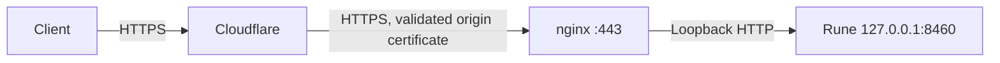

# Rune public endpoint

The public API is **https://rune.surogate.ai**, with decisions at `/v1/decisions`.
The existing API key is required through `Authorization: Bearer ...` or `x-api-key`.
The key remains in `/home/flavius/work/deployment/rune-v3/api-key`, outside the repository.
All model weights remain on this server.



Cloudflare provides the public certificate and proxies the DNS A record. Nginx terminates
origin TLS, enforces the route allowlist and limits each actual client IP to one request per
second without an extra burst. The engine authenticates API keys and bounds total inference,
image and thinking concurrency. Native port8460 remains bound to loopback.

## Cloudflare configuration

All new rules match only `rune.surogate.ai`:

- Origin encryption: **Full (strict)** through a configuration rule. The zone-wide SSL mode
  and other hosts were left unchanged.
- Browser Integrity Check: disabled for this API hostname. Its inherited browser check
  returned Cloudflare error1010 to Python's default HTTP client; API clients now work without
  pretending to be browsers. Other zone security controls remain unchanged.
- Cache rule: bypass caching. Nginx also sends `Cache-Control: no-store`, including on 429s.
- HTTP redirect:308 to the same HTTPS hostname/path, preserving the query string.
  The existing redirect rules are preserved.

The active Cloudflare edge certificate already covers `*.surogate.ai`. A separate Origin CA
certificate covers only `rune.surogate.ai`; its private key was generated on this server.
Installed files are `/etc/rune-v3/tls/rune.surogate.ai.{crt,key}`. The key is root-only and
the certificate expires **2041-09-23**. Keep that expiration in the certificate inventory.
Origin CA certificates are trusted by Cloudflare, not ordinary browsers, so keep the DNS
record proxied with this certificate/access policy.

Cloudflare API credentials were used for setup and are not needed by either running service.
The local API operation records, certificate inventory and rollback information are in
`/home/flavius/work/deployment/rune-v3/cloudflare/`, with directory access restricted to
the owner. Credentials, keys and operation records are not committed.

## Client-IP trust and origin access

`render_nginx.py --cloudflare-ips FILE` reads one CIDR per line. Blank lines and comments are
allowed; malformed, empty and all-address trust lists are rejected. The installed list is
`/etc/rune-v3/cloudflare-ips.txt`, fetched from Cloudflare's official
[`/client/v4/ips` API](https://developers.cloudflare.com/api/resources/ips/methods/list/).

Nginx uses `set_real_ip_from` and `real_ip_header CF-Connecting-IP`. Its rate-limit key is
the resulting actual client address. A separate `geo` check uses `$realip_remote_addr`,
the original socket peer, to reject traffic that did not come from Cloudflare or local
loopback. Checking the rewritten address here would accidentally reject legitimate callers.
Loopback readiness checks remain possible, while forged forwarding headers from untrusted
peers cannot alter their rate-limit key. Requests for other hostnames are rejected.

Refresh the CIDR file from Cloudflare periodically, then re-render and validate before
reloading. The current rendering command is:

```bash
sudo python3 render_nginx.py \
  --hostname rune.surogate.ai --listen 0.0.0.0:443 --worker-user www-data \
  --cloudflare-ips /etc/rune-v3/cloudflare-ips.txt \
  --per-ip-rps 1 --per-ip-burst 0 \
  --certificate /etc/rune-v3/tls/rune.surogate.ai.crt \
  --private-key /etc/rune-v3/tls/rune.surogate.ai.key \
  --prefix /var/lib/rune-v3-proxy --output /etc/nginx/rune-next.conf
sudo nginx -t -c /etc/nginx/rune-next.conf
sudo install -m 644 /etc/nginx/rune-next.conf /etc/nginx/nginx.conf
sudo systemctl reload nginx
```

Change `--per-ip-rps` and `--per-ip-burst` to adjust the public per-IP policy. The Ubuntu
nginx unit has a `PIDFile=/var/lib/rune-v3-proxy/nginx.pid` override in
`/etc/systemd/system/nginx.service.d/rune-pid.conf`. Both nginx and Rune are enabled at boot.
Origin access/error logs are under `/var/lib/rune-v3-proxy/` and do not log credentials or
request bodies. The included `nginx.logrotate` is installed as
`/etc/logrotate.d/rune-v3-proxy`, rotating daily with14 archives and compression.

## Validation on 2026-09-27

The CPU-only `test_cloudflare_proxy.py` runs real nginx against a temporary stub backend,
without a model/GPU. It checks distinct clients behind one trusted proxy, IPv6 clients,
429/Retry-After, forged-header rejection, origin/hostname/route restrictions, no-store and
the original direct-client mode. Run it with `python3 test_cloudflare_proxy.py` on a host
with nginx's realip module and OpenSSL installed.

Public checks used a normal Python HTTP client through Cloudflare, with normal certificate
verification:

- Health200; HTTP308 to HTTPS.
- Missing/invalid API keys401; both supported authentication headers200.
- Text, image and thinking decisions200; thinking generated512 reasoning tokens.
- An eight-request burst from one IP: one200 and seven429, each with Retry-After1.
- Forged proxy-header requests were rejected before reaching the origin; no limit bypass.
- Authenticated `/metrics` and `/v1/chat/completions` requests404.
- Direct public-IP origin access403; health recovered after the burst.
- Both services active/enabled with zero restarts.

Evidence: `deployment/rune-v3/staging/public-cloudflare-verification.json`,
`agent/logs/rune-public-verification.log` and `agent/logs/rune-cloudflare-proxy-tests.log`
under `/home/flavius/work/`.

Cloudflare imposes its own origin response timeout (currently125seconds by default), which
can be shorter than nginx's600second read timeout. Long synchronous requests must fit the
edge limit. See [Cloudflare connection limits](https://developers.cloudflare.com/fundamentals/reference/connection-limits/).

To take the API offline, stop `nginx.service` or remove only the Rune DNS record. The local
engine can remain available. Rollback records identify the new rules and DNS record; remove
only those entries when undoing this deployment, preserving the existing zone rules.
