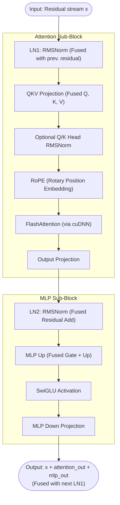
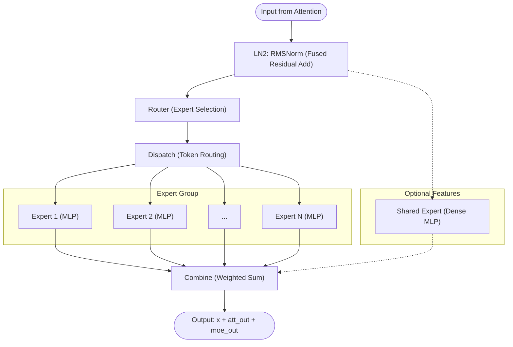
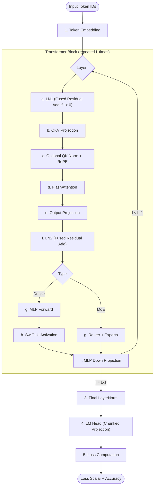
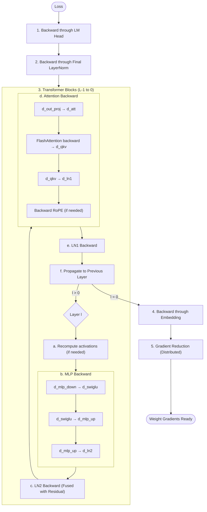

import Figure from '@site/src/components/Figure';

This document explains how Surogate implements the transformer architecture for training, including the forward pass, backward pass, recomputation strategies, kernel fusions, and LoRA integration.

## Table of Contents

- [Transformer Block Structure](#transformer-block-structure)
- [Forward Pass](#forward-pass)
- [Backward Pass](#backward-pass)
- [Kernel Fusions](#kernel-fusions)
- [Recomputation Options](#recomputation-options)
- [LoRA Integration](#lora-integration)
- [Mixture of Experts (MoE)](#mixture-of-experts-moe)

---

## Transformer Block Structure

Surogate implements the **pre-norm transformer architecture**, where layer normalization is applied before each sub-layer rather than after. This design improves training stability, especially for larger models.

### Block Architecture

Each transformer block consists of two sub-blocks: an attention sub-block and an MLP (feed-forward) sub-block. Surogate uses a highly optimized implementation that fuses residual additions with normalization passes.

{/* <Figure src="/img/transformer-block.png" height={600}
   alt="Transformer Block Structure in Surogate" 
   caption="Transformer Block Structure in Surogate" /> */}



### Pre-norm Formula

The mathematical formulation for each block is:

```
x_mid = x + Attention(RMSNorm(x))
x_out = x_mid + MLP(RMSNorm(x_mid))
```

In Surogate, the additions are fused into the subsequent `RMSNorm` kernels whenever possible to reduce memory bandwidth consumption.

### Key Components

| Component          | Description                                                                    |
| ------------------ | ------------------------------------------------------------------------------ |
| **RMSNorm**        | Root Mean Square Layer Normalization - simpler and faster than LayerNorm       |
| **QKV Projection** | Projects input to Query, Key, and Value vectors in a single fused operation    |
| **QK Norm**        | Optional per-head normalization applied to Q and K (used in architectures like Qwen3) |
| **RoPE**           | Rotary Position Embedding - encodes position information using complex rotations |
| **FlashAttention** | Memory-efficient attention via cuDNN, using tiling to minimize SRAM-HBM traffic |
| **SwiGLU**         | Fused gated activation: `swish(gate) * up`                                     |
| **MLP Up**         | Fused projection combining both Gate and Up weight matrices into one matmul     |

---

## Mixture of Experts (MoE)

Surogate provides first-class support for Mixture of Experts (MoE) architectures, replacing the dense MLP sub-block with a dynamically routed group of experts.

### MoE Block Structure

In an MoE block, the standard MLP is replaced by a **Router** and an **Expert Group**:



### Routing Strategies

Surogate supports several routing algorithms to balance computation and accuracy:

| Strategy | Description | Best For |
| :--- | :--- | :--- |
| **Top-k Routing** | Standard strategy (e.g., Mixtral 8x7B) where each token is sent to the $k$ highest-scoring experts. | Balanced performance/accuracy |
| **Switch Routing** | Top-1 routing with specific load balancing to prevent expert collapse. | Maximum throughput |
| **Expert Choice** | Experts "choose" tokens rather than tokens choosing experts, ensuring perfect load balancing. | High-quality fine-tuning |

### Implementation Details

1.  **Fused Dispatch/Combine**: Surogate uses highly optimized kernels for token dispatch (moving tokens to experts) and combine (gathering expert outputs) to minimize the overhead of routing.
2.  **Shared Experts**: Supports DeepSeek/Nemotron-style shared experts that process all tokens regardless of the router's decision. This shared MLP capture cross-expert knowledge and improves stability.
3.  **Fast Expert LoRA**: When fine-tuning MoE models with LoRA, Surogate uses a specialized `FastExpertLoRA` implementation that:
    *   Fuses LoRA application with the expert's GEMM operations.
    *   Reduces activation storage by ~12% by using in-place backward passes.
    *   Is up to 30% faster than naive per-expert LoRA applications.

---

## Forward Pass

The forward pass processes input tokens through the entire model to produce output logits and compute loss.

### Full Model Forward Flow

Surogate's forward pass is designed to minimize GPU-to-CPU copies and global memory traffic through aggressive kernel fusion.



#### Detailed Flow Steps

1.  **Token Embedding**: Converts token IDs $(B, T)$ into hidden states $(B, T, C)$. Position IDs are used with RoPE rather than added to embeddings.
2.  **Transformer Blocks** (residual stream stored at each block boundary):
    *   **LN1**: Applies RMSNorm. For all layers after the first, this kernel also performs a **fused residual addition** of the previous layer's attention and MLP outputs. The normalized output and reciprocal standard deviation (`rstd`) are saved for backward.
    *   **QKV Projection**: A single GEMM kernel projects hidden states to a packed Query, Key, and Value buffer. When using mixed precision, the input may be quantized (with `abs_max` scale factor stored) before the matmul.
    *   **QK Norm + RoPE**: Optional per-head normalization for Q and K (with `rstd` saved), followed by Rotary Position Embeddings applied using precomputed frequency tables.
    *   **FlashAttention**: Uses the FlashAttention-2 algorithm (via cuDNN) to compute attention without materializing the $O(T^2)$ attention matrix. Saves log-sum-exp (`lse`) statistics for backward.
    *   **Output Projection**: Projects the attention output back to the model dimension $C$. The attention output is saved before this projection.
    *   **LN2**: Applies RMSNorm with a **fused residual addition** of the attention sub-block's output, producing `residual_att` (residual after attention). Saves normalized output and `rstd`.
    *   **MLP Up / MoE Router**: In dense models, a single GEMM kernel computes both Gate and Up projections (output shape: $2 \times D$ where $D$ is `intermediate_size`). In MoE models, this stage involves the **Router** selecting experts and **Dispatching** tokens. Input may be quantized for mixed precision.
    *   **SwiGLU / Experts**: A fused activation kernel applying `swish(gate) * up` (Dense) or the parallel execution of multiple gated MLP **Experts** (MoE). Output shape is $(B, T, D)$ where $D$ is `intermediate_size`.
    *   **MLP Down**: Projects the MLP output back to the model dimension $C$. The SwiGLU output may be quantized before this projection.
3.  **Final LayerNorm**: A final RMSNorm pass applied to the cumulative residual stream.
4.  **LM Head**: Projects hidden states to the vocabulary size. This is performed in **chunks** to save peak memory.
5.  **Loss Computation**: Computes Cross-Entropy loss between logits and labels.

### Activation Storage

During the forward pass, certain activations must be stored for the backward pass. The exact shapes depend on the model architecture (number of heads, intermediate size, etc.).

#### Core Activations (Per Transformer Block)

| Activation      | Shape                  | Purpose                                              |
| --------------- | ---------------------- | ---------------------------------------------------- |
| `ln1.output`    | (B, T, C)              | RMSNorm output fed to attention (input after norm)   |
| `ln1.rstd`      | (B\*T,)                | Reciprocal std deviation for RMSNorm backward        |
| `qkv_output`    | (B, T, qkv_channels)   | QKV after projection and RoPE (qkv_channels varies) |
| `lse`           | (B, num_heads, T)      | Log-sum-exp from FlashAttention for backward         |
| `attention_out` | (B, T, C)              | Attention output before output projection            |
| `residual_att`  | (B, T, C)              | Residual stream after attention (residual + att_out) |
| `ln2.output`    | (B, T, C)              | RMSNorm output fed to MLP (input after norm)         |
| `ln2.rstd`      | (B\*T,)                | Reciprocal std deviation for RMSNorm backward        |
| `mlp_up_output` | (B, T, 2\*D)           | Gate+Up projection output (D = intermediate_size)    |
| `mlp_down_input`| (B, T, D)              | SwiGLU activation output (input to down projection)  |

**Notes:**
- `qkv_channels` = (num_query_heads + 2 × num_kv_heads) × head_size. For standard attention this equals 3C, but for Grouped Query Attention (GQA) it's smaller.
- `intermediate_size` (D) is typically 4C but varies by architecture (e.g., 3.5C for some models).
- When using **Grouped Query Attention (GQA)**, K and V have fewer heads than Q, reducing QKV memory.

#### Optional Activations

| Activation     | Shape              | When Stored                         |
| -------------- | ------------------ | ----------------------------------- |
| `q_rstd`       | (B, T, num_q_heads)| When using QK normalization (Qwen3) |
| `k_rstd`       | (B, T, num_kv_heads)| When using QK normalization (Qwen3)|

#### Quantization Metadata (Mixed Precision Training)

When using FP8/FP4 recipes, additional metadata is stored:

| Metadata           | Shape    | Purpose                                    |
| ------------------ | -------- | ------------------------------------------ |
| `qkv_input.abs_max`| (1,)     | Scaling factor for quantized QKV input     |
| `mlp_up_input.abs_max`| (1,)  | Scaling factor for quantized MLP up input  |
| `mlp_down_input.abs_max`| (1,)| Scaling factor for quantized MLP down input|

#### Memory Impact

For a typical dense transformer with C=4096, D=14336 (3.5×C), B=2, T=2048:

- **Without recomputation**: ~600 MB per layer
- **With `recompute_attention`**: ~400 MB per layer (recomputes QKV, LSE preserved)
- **With `recompute_block`**: ~150 MB per layer (only residuals and LSE preserved)

See [Recomputation Options](#recomputation-options) for memory-compute tradeoffs.

### LM Head Chunking

For memory efficiency, the language modeling head (vocabulary projection) is computed in chunks:

```
For each chunk of sequence positions:
    logits_chunk = hidden_chunk @ lm_head_weight
    loss_chunk = cross_entropy(logits_chunk, labels_chunk)
    Accumulate loss and backpropagate immediately
```

This avoids materializing the full `(B, T, vocab_size)` logits tensor, which can be enormous for large vocabularies (32K-150K tokens).

---

## Backward Pass

The backward pass computes gradients by flowing error signals from the loss back through the network.

### Backward Flow



### Gradient Computation Patterns

For linear layers, gradients are computed as:

```
# Forward: output = input @ weight.T + bias
# Backward:
d_input = d_output @ weight           # Propagate gradient
d_weight = input.T @ d_output         # Weight gradient
d_bias = d_output.sum(dim=0)          # Bias gradient (if present)
```

### Gradient Accumulation

When using gradient accumulation across micro-batches:

```
For each micro-batch in accumulation_steps:
    Forward pass
    Backward pass (gradients accumulated, not replaced)

# After all micro-batches:
Normalize gradients by accumulation_steps
Optimizer step
Zero gradients
```

---

## Kernel Fusions

Surogate implements several kernel fusions to reduce memory bandwidth and kernel launch overhead.

### Fused Residual + RMSNorm

Instead of separate kernels for residual addition and normalization:

```
# Unfused (2 kernels, 2 memory writes):
residual_out = residual1 + residual2
norm_out = rmsnorm(residual_out)

# Fused (1 kernel, 1 memory write):
residual_out, norm_out = fused_residual_rmsnorm(residual1, residual2, weight)
```

This fusion saves one global memory write of the full residual tensor.

### RMSNorm + Quantization

For FP8/FP4 recipes, normalization and quantization are fused:

```
# Fused operation:
norm_out, absmax = rmsnorm_forward_quant(input, weight)
```

The absmax value (for quantization scaling) is computed during the normalization pass without additional memory traffic.

### SwiGLU Activation

The SwiGLU activation is computed as:

```
# Gate and Up are packed together from MLP up projection
gate, up = split(mlp_up_output)
output = swish(gate) * up
```

Forward and backward are implemented as single fused kernels.

### FlashAttention

Attention is computed using the FlashAttention algorithm via cuDNN:

```
# Single fused operation instead of:
# scores = Q @ K.T / sqrt(d)
# weights = softmax(scores)
# output = weights @ V

output, lse = flash_attention(Q, K, V, causal_mask=True)
```

FlashAttention uses tiling to keep intermediate results in SRAM, dramatically reducing memory usage from O(T²) to O(T).

### Fused RoPE

Rotary Position Embedding (RoPE) encodes position information by rotating pairs of dimensions:

```
# RoPE rotation formula for dimension pairs (x, y):
x' = x * cos(θ) - y * sin(θ)
y' = x * sin(θ) + y * cos(θ)

# Where θ depends on position and dimension index
```

The frequency table (cos/sin pairs) is precomputed on CPU and stored for the maximum sequence length. The GPU kernel applies rotations to Q and K heads while passing V through unchanged.

### Fused Q/K Norm + RoPE (for Qwen3-like models)

For models using per-head Q/K normalization (like Qwen3), three operations are fused into a single kernel:

```
# Unfused (3 kernels, 3 memory passes):
q_normalized = rmsnorm(q, q_weight)  # Per-head RMSNorm
k_normalized = rmsnorm(k, k_weight)  # Per-head RMSNorm
q_rope, k_rope = rope(q_normalized, k_normalized, freqs_cis)

# Fused (1 kernel, 1 memory pass):
q_rope, k_rope = fused_qk_norm_rope(qkv, q_weight, k_weight, freqs_cis)
```

The fused kernel operates on the packed QKV buffer in-place:

1. Computes RMSNorm statistics (mean square) for each Q/K head
2. Applies normalization with learned weights
3. Applies RoPE rotation immediately after normalization
4. Writes the final result back to the same buffer

This fusion eliminates two intermediate memory writes and reduces kernel launch overhead.

### Fused LoRA Backward (Unsloth-style)

During LoRA backward pass, multiple projections share the same input tensor. Surogate fuses these operations to reduce redundant memory loads and kernel launches.

**Fused QKV LoRA Backward:**

The Q, K, and V projections all share the same input (LN1 output). Instead of computing each backward independently:

```
# Unfused (15 matmuls, 3× redundant x loads):
# For each projection p in {Q, K, V}:
intermediate_p = x @ A_p.T
dB_p = intermediate_p.T @ dL_dy_p
temp_p = dL_dy_p @ B_p.T
dA_p = x.T @ temp_p
dx += temp_p @ A_p

# Fused (12 matmuls, 1× x load, batched dx accumulation):
# Phase 1: Compute x @ A.T for all projections (reuses x in cache)
# Phase 2: Compute dB for all projections
# Phase 3: Compute dL_dy @ B.T and dA for all projections
# Phase 4: Accumulate dx contributions
```

**Fused MLP Gate+Up LoRA Backward:**

The gate and up projections share the same input (LN2 output):

```
# Unfused (10 matmuls, 2× redundant x loads):
# Separate backward for gate and up

# Fused (8 matmuls, 1× x load):
# Process both projections with shared input tensor
```

**Benefits:**

| Optimization   | Matmul Reduction | Memory Benefit              |
| -------------- | ---------------- | --------------------------- |
| QKV fusion     | 15 → 12 (20%)    | Single x load instead of 3  |
| Gate+Up fusion | 10 → 8 (20%)     | Single x load instead of 2  |
| Input reuse    | -                | Better L2 cache utilization |

These fusions are inspired by Unsloth's approach to LoRA optimization, reducing kernel launch overhead and improving memory bandwidth utilization during the backward pass.

---

## Recomputation Options

Recomputation (gradient checkpointing) trades compute for memory by not storing certain activations during forward pass, instead recomputing them during backward pass.

### Available Recomputation Flags

| Flag                  | What Gets Recomputed              | Memory Saved              |
| --------------------- | --------------------------------- | ------------------------- |
| `recompute_rmsnorm`   | LN1 and LN2 outputs               | ~2 × (B, T, C) per layer  |
| `recompute_qkv`       | QKV projection                    | ~3 × (B, T, C) per layer  |
| `recompute_attention` | Full attention (softmax + output) | LSE tensor + att output   |
| `recompute_swiglu`    | SwiGLU activation output          | ~2 × (B, T, 4C) per layer |
| `recompute_ffn`       | MLP up + SwiGLU                   | ~4 × (B, T, 4C) per layer |
| `recompute_block`     | Entire block (all of above)       | Maximum savings           |

### Recomputation Hierarchy

The flags form a hierarchy where higher-level flags imply lower-level ones:

```
recompute_block
    ├── recompute_attention
    │       └── recompute_qkv
    ├── recompute_ffn
    │       └── recompute_swiglu
    └── recompute_rmsnorm
```

### When to Use Each Level

| Scenario                 | Recommended Setting         |
| ------------------------ | --------------------------- |
| Plenty of VRAM           | No recomputation (fastest)  |
| Moderate memory pressure | `recompute_attention: true` |
| High memory pressure     | `recompute_block: true`     |
| Fine-grained control     | Individual flags as needed  |

### Memory-Compute Tradeoff

Example for a 4B parameter model with batch size 2, sequence length 2048:

| Setting               | Activation Memory | Compute Overhead |
| --------------------- | ----------------- | ---------------- |
| No recompute          | ~8 GB             | Baseline         |
| `recompute_attention` | ~5 GB             | ~15% slower      |
| `recompute_block`     | ~2 GB             | ~33% slower      |

### LoRA-Specific Recomputation

With LoRA, `recompute_block: true` also recomputes LN1/LN2 on-demand from the residual stream during the LoRA backward pass, instead of storing per-layer LN activations:

```
# Without recompute_block: store ln1 for all 36 layers (~360 MB)
# With recompute_block: recompute ln1 from residual when needed

ln1 = rmsnorm(residual, weight)  # Recomputed during backward
d_lora = backward_lora(ln1, d_output)
```

This saves ~600MB for 4B models by trading a small amount of compute (one RMSNorm per layer) for significant memory savings.

---

## LoRA Integration

Low-Rank Adaptation (LoRA) enables efficient fine-tuning by adding small trainable matrices to frozen base weights.

### LoRA Concept

Instead of updating the full weight matrix W, LoRA adds a low-rank decomposition:

```
W' = W + α × (B @ A)

Where:
- W: Original weight matrix (frozen) - shape (out, in)
- A: Low-rank down projection (trainable) - shape (rank, in)
- B: Low-rank up projection (trainable) - shape (out, rank)
- α: Scaling factor (lora_alpha / lora_rank)
```

For a 4096×4096 weight with rank 16:

- Original parameters: 16.7M
- LoRA parameters: 131K (0.8% of original)

### LoRA Forward Pass

```
# Base computation (frozen weights, possibly quantized)
base_output = input @ W.T

# LoRA contribution (full precision)
lora_intermediate = input @ A.T        # (B, T, rank)
lora_output = lora_intermediate @ B.T  # (B, T, out)

# Combined output
output = base_output + α × lora_output
```

### LoRA Backward Pass

In LoRA-only mode (typical fine-tuning), base weight gradients are skipped:

```
# Gradient w.r.t. LoRA weights only
d_B = d_output.T @ lora_intermediate   # (out, rank)
d_A = input.T @ (d_output @ B)         # (rank, in)

# Gradient still propagates through base weights for input gradient
d_input = d_output @ W + α × (d_output @ B @ A)
```

### Layers Modified by LoRA

| Layer             | Weight Shape | LoRA Applied |
| ----------------- | ------------ | ------------ |
| QKV Projection    | (3×C, C)     | Yes          |
| Output Projection | (C, C)       | Yes          |
| MLP Up (Gate+Up)  | (8×C, C)     | Yes          |
| MLP Down          | (C, 4×C)     | Yes          |
| Embedding         | (vocab, C)   | Optional     |

### QLoRA: Quantized Base + LoRA

QLoRA combines 4/8-bit quantized base weights with full-precision LoRA:

```
# Base weights stored as 4/8-bit (FP8, FP4 or NF4)
W_quantized = quantize_4bit(W)

# Forward pass
W_dequantized = dequantize(W_quantized)  # On-the-fly
base_output = input @ W_dequantized.T
lora_output = ... # Same as above
output = base_output + α × lora_output
```

This reduces the base model memory by 4× while maintaining full-precision gradients for LoRA weights.

---

## Summary

Surogate's transformer implementation is designed for maximum training efficiency:

1. **Pre-norm architecture** for training stability
2. **Extensive kernel fusions** to minimize memory bandwidth
3. **Flexible recomputation** for memory-compute tradeoff control
4. **LoRA/QLoRA support** for efficient fine-tuning
5. **Multiple precision recipes** (BF16, FP8, FP4) for different hardware

The modular design allows users to tune memory usage and performance for their specific hardware and model size requirements.

---

## See also

- [Performance](../guides/performance.md)
- [Precision & recipes](../guides/precision-and-recipes.md)
- [Back to docs index](../index.mdx)
