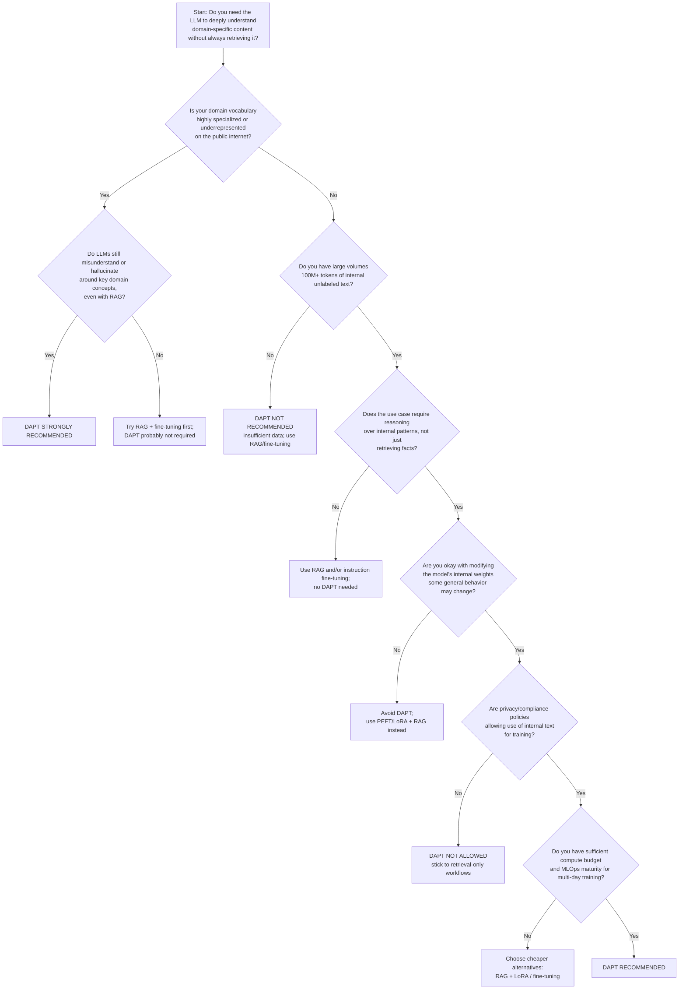

With LLMs, pretraining refers to the initial phase of training a language model on a large corpus of text data. This phase allows the model to learn general language patterns, grammar, and knowledge about the world. The goal of pretraining is to create a strong foundation that can be fine-tuned for specific tasks later on.

Continued pretraining, on the other hand, involves taking a pretrained model and further training it on a more specific dataset or domain. This process helps the model adapt to particular language styles, terminologies, or contexts that are relevant to the target application. Continued pretraining can enhance the model's performance on specialized tasks by providing it with additional context and knowledge that may not have been present in the original pretraining data.

> [!IMPORTANT]
Continued pretraining an instruction-tuned model can lead to the loss of its instruction-following capabilities. It is generally recommended to perform continued pretraining on the base model before any instruction tuning is applied.  
> If you do need to continue pretaining an instruction-tuned model, be sure to re-apply instruction tuning afterward to restore those capabilities.

## When to Use Pretraining / Continued Pretraining

### 1. Full Pretraining (from scratch)
This kind of pretraining is never required in an enterprise setting, as it is extremely resource-intensive and time-consuming. It is typically only performed by large organizations with significant computational resources and access to vast amounts of text data.
Full pretraining requires:
- Billions–trillions of tokens
- Weeks–months of GPU computing time
- A large AI research team
- Sophisticated data engineering and safety filtering

When would an enterprise EVER do this? On rare cases like:
- Government/intelligence agencies dealing with extreme secrecy or national security constraints.
- Highly regulated industries with no external data allowed (e.g., certain defense, energy or critical infrastructure sectors).
- Language/culture-specific needs that no public models support (e.g., low-resource languages, dialects, or internal code systems.)
 

> [!TIP]
> For 99% of enterprises, pretraining your own foundation model is unnecessary.

### 2. Continued Pretraining (Domain Adaptive Pretraining - DAPT)
This is sometimes needed and much more realistic. It is useful when the enterprise:

- **has extremely domain-specific jargon** (e.g., pharmaceutical chemistry (SMILES, assay results, clinical protocols), telecom logs, network events, error codes, financial trading signals or risk models, legal contracts with highly repetitive patterns)
- **has important communication patterns NOT found on public web**: large models usually don’t understand these well without domain adaptation (e.g. proprietary product names, internal acronyms & org structure, standard operating procedures, historical documents spanning decades, internal incident reports / engineering logs)
- **has long-form internal documents the LLM must "absorb" structurally** and not just retrieve via RAG like (e.g., technical specs, scientific literature, engineering manuals, regulatory filings)
- **must a model that supports RAG + reasoning more reliably** because RAG gives facts, but continued pretraining improves (e.g. in-context understanding, formatting conventions, terminology coherence, reasoning in domain-specific situations)
- **wants to improve embedding quality for enterprise retrieval** because domain-adaptive pretraining can dramatically improve retrieval accuracy and similarity scoring.
- **wants the model to internalize internal language norms** like tone, writing style, compliance language, report templates.

## When Continued Pretraining Is NOT Necessary
Most enterprise needs can be handled by:
- RAG
- Instruction tuning
- LORA fine-tuning
- Custom prompting
- Tool use / Agent frameworks

Continued pretraining is NOT needed when:
- You only need factual QA using documents
- You can rely on retrieval instead of modifying the model’s internal weights
- You must preserve the base model’s general reasoning abilities
- Compute is limited or cost is a concern

> [!TIP]
> RAG + fine-tuning is enough for ~80% of use cases.

## Decision Tree

